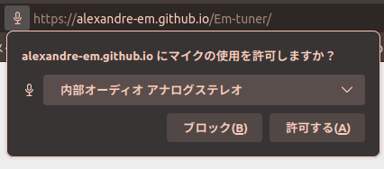
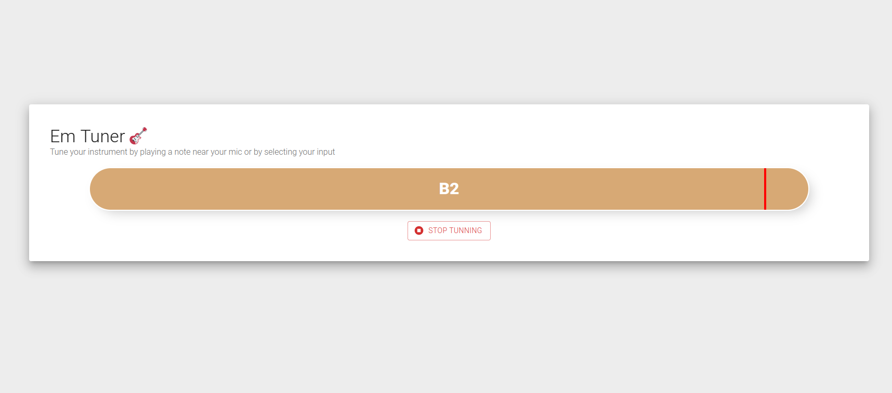

# Em Tuner
Em Tuner is an implementation of a guitar tuner *(but can also be used with other instrument)* developed in ReactJs. It has been automatically deployed on Github page and can be accessed from [here](https://alexandre-em.github.io/Em-tuner/).

## Getting started
### Local
```bash
	$ git clone https://github.com/alexandre-em/Em-tuner
	$ cd Em-tuner
	$ yarn # or npm install
	$ yarn start
```

### Docker
```bash
	$ git clone https://github.com/alexandre-em/Em-tuner
	$ cd Em-tuner
	$ docker build -t em-tuner:dev .
	$ docker run --rm -p 5000:5000 --name em-tuner -d em-tuner:dev
	# Wait for the application finish to run
```
You can then run the application from your browser on *localhost* on port:
* `5000` if you run it on a *Docker* container
* `3000` if you run it on your environment

## Application
To use the tuner, you have to click on the `Start tuning` button. A pop up will show and you'll have to select and authorize the use of an input. Once the input selected, the tuner will begin the note computation whenever you play a note. When you finished to tune your instrument, you can click on `Stop` to stop the usage of the mic on the app.

>If you have an audio interface with your instrument (or your mic) plugged in, consider it to have a better result





## Usage
### Tuner Component
```jsx
	const handleStart = useCallback(() => console.log('onStart'),[]);
	const handleClose = useCallback(() => console.log('onClose'),[]);

	<Tuner show onStart={handleStart} onClose={handleClose} />
```

### useFrequency hook
```js
	const { TreeNode, toBST, frequenciesBST, closestValue } = useFrequency();
```

| Name | Type | Description |
|------|------|-------------|
| TreeNode | Class | A class representing a binary tree, that will be used to compare frequencies |
| toBST(frequencies) | Function | Take an *Array* of objects containing a `frequency` and a `note` and convert it into a `TreeNode` instance
| frequenciesBST | Variable | is a default use of `toBST` method, frequencies range used is `[28, 494]`
| closestValue(tree, frequency) | Function | find the closest note that matches the `frequency`

## Documentation
A documentation can be generated from the code, on a static web page using the plugin `jsdoc`
```bash
	$ yarn docs:generate
```
## Test (WIP)
```bash
	$ yarn test --coverage # omit--coverage option if you do not need to see it
```

```
-------------------|---------|----------|---------|---------|-------------------
File               | % Stmts | % Branch | % Funcs | % Lines | Uncovered Line #s 
-------------------|---------|----------|---------|---------|-------------------
All files          |   53.44 |    33.78 |   37.03 |   52.83 |                   
 src               |   30.76 |        0 |   33.33 |   30.76 |                   
  App.js           |     100 |      100 |     100 |     100 |                   
  App.style.js     |     100 |      100 |     100 |     100 |                   
  index.js         |       0 |      100 |     100 |       0 | 6                 
  ...tWebVitals.js |       0 |        0 |       0 |       0 | 1-8               
 src/components    |   53.06 |    23.07 |   35.71 |   53.65 |                   
  Tuner.js         |      50 |    25.71 |   41.66 |   47.22 | ...-65,89,106-107 
  Tuner.style.js   |   71.42 |        0 |       0 |     100 | 38-39             
 src/hooks         |   96.55 |    81.25 |     100 |   96.29 |                   
  useFrequency.js  |   96.55 |    81.25 |     100 |   96.29 | 87                
 src/utils         |      16 |       20 |       0 |      16 |                   
  ...hDetection.js |      16 |       20 |       0 |      16 | 22-26,34-41,51-69 
-------------------|---------|----------|---------|---------|-------------------
```
# Note
>The logo displayed is using a tuner icon created by *Christopher T. Howlett*